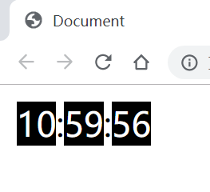
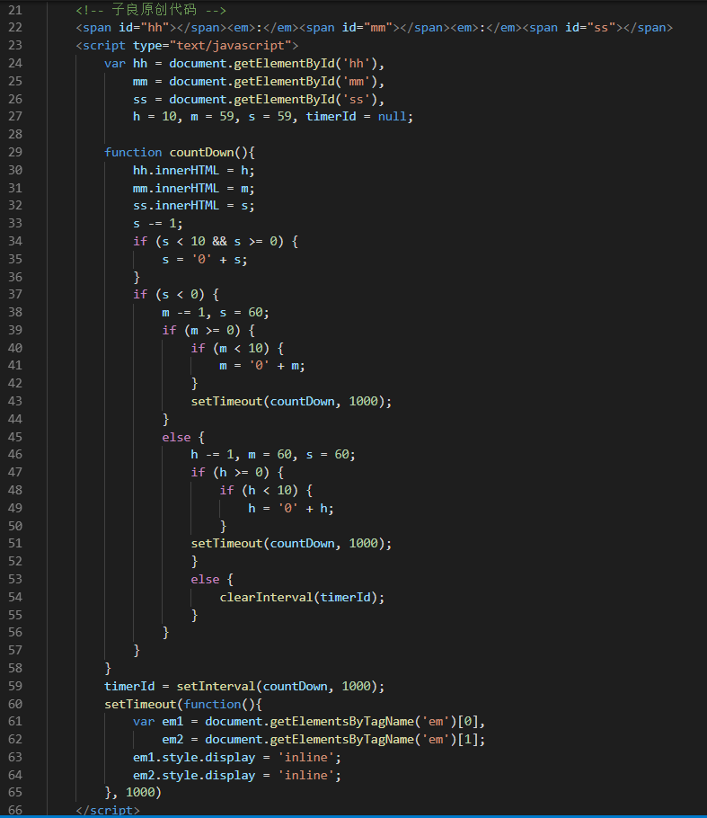

### web / countdown2.html 文件说明 -- 纯JS实现的"时:分:秒"的倒计时器。 
##### 有学员问我，实现网页上常见的倒计时器的思路是什么，其实只需要掌握住setInterval()和setTimeout()这两个方法，
##### 以及递归调用的用法就可以轻松的实现，在倒数到一定条件后，立刻调用递归，并将上一位减1再重设变量值即可，
##### 以下为效果图与范例代码：

